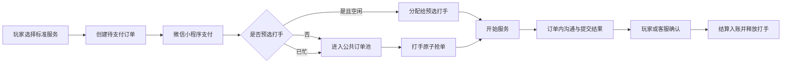

# 沧月电竞服务平台

面向三角洲行动陪玩与护航业务的多角色订单平台。项目覆盖玩家下单、打手接单履约、订单内沟通、客服管理和微信小程序支付，重点演示完整业务状态机、支付幂等与并发一致性处理。

> 当前阶段：可演示、可联调的 MVP。开发环境默认使用 H2 与模拟支付；正式上线前仍需完成主体资质、微信小程序审核、YunGouOS 商户配置、域名备案及真实支付验收。

## 产品形态

- 玩家端小程序：浏览标准服务、直接下单付款、查看进度、在订单内传递房间号、评价与个人中心。
- 打手端：订单池、抢单、开始服务、提交结果、订单消息、收益与接单状态。
- 客服管理后台：服务配置、创建/派发订单、订单审核、公告、打手与结算管理。
- H5 原型：保留玩家与打手完整业务页面，便于浏览器演示和快速验收。

## 技术栈

| 模块 | 技术 |
| --- | --- |
| 后端 | Java 17、Spring Boot、MyBatis-Plus、MySQL/H2、JWT |
| 微信小程序 | uni-app、Vue 3、TypeScript、Pinia |
| H5 玩家/打手端 | Vue 3、Vite、Vant、Tailwind CSS |
| 客服后台 | Vue 3、Vite、Element Plus、Pinia |
| 支付 | 可插拔支付网关；当前实现 YunGouOS 小程序支付、查单、回调、关单与退款 |

## 核心业务流程



未上架的非标准服务由玩家联系客服协商，再由客服创建订单；已有标准服务不增加咨询步骤。

## 一致性与安全设计

- 抢单、开始、提交、确认和退款使用带状态条件的原子更新，避免重复履约或重复结算。
- 打手状态采用 `idle → busy → idle` 原子流转，防止同一打手并发接取两单。
- 支付准备锁定业务订单；支付回调、主动查单和退款均做幂等处理。
- 玩家预选打手在支付成功时才占用；若已被占用，订单自动回到公共订单池。
- 礼物扣款使用数据库余额条件更新，避免并发超扣，并校验金额范围与精度。
- JWT 区分访问令牌与刷新令牌；角色接口、订单详情和公开打手信息均做权限/字段隔离。
- 生产环境不初始化演示账号，数据库密码、JWT 密钥与 CORS 来源必须由环境变量提供。

## 本地运行

要求：JDK 17、Node.js 20+、npm。

```powershell
# 后端（默认 dev：H2 + 模拟支付）
cd backend
.\mvnw.cmd spring-boot:run

# 客服后台
cd ..\frontend-admin
npm install
npm run dev

# H5 玩家/打手端
cd ..\frontend-mobile
npm install
npm run dev

# 微信小程序
cd ..\frontend-uniapp
npm install
npm run dev:mp-weixin
```

也可以在 Windows 下运行 `start-all.cmd` 启动后端和两个 Web 前端。微信开发者工具应导入仓库根目录，`project.config.json` 已将小程序根目录指向 `frontend-uniapp/dist/dev/mp-weixin/`。

## 验证命令

```powershell
cd backend
.\mvnw.cmd test

cd ..\frontend-admin
npm run build

cd ..\frontend-mobile
npm run build

cd ..\frontend-uniapp
npm run type-check
npm run build:mp-weixin
```

## 上线配置

- [部署说明](docs/deployment-guide.md)
- [支付接入与回调说明](docs/payment-integration.md)
- [支付表迁移](docs/payment-migration.sql)
- [本次发布迁移](docs/release-migration.sql)

生产部署前至少需要配置 `MYSQL_USERNAME`、`MYSQL_PASSWORD`、`JWT_SECRET`、`CORS_ORIGINS`，以及支付和微信小程序相关环境变量。任何密钥都不应提交到仓库。

